# Harmos - Database Entity-Relationship Diagram

## Overview

The Harmos healthcare management system uses **PostgreSQL** with **Hibernate/JPA** auto-generated schema.
The database consists of **10 entities**, **4 join tables**, and **2 element collection tables** (16 tables total).

## Mermaid ERD

```mermaid
erDiagram
    users {
        BIGINT id PK
        VARCHAR email
        VARCHAR password
        VARCHAR first_name
        VARCHAR last_name
        VARCHAR phone
    }

    Patients {
        BIGINT id PK
        VARCHAR first_name
        VARCHAR last_name
        VARCHAR phone
        VARCHAR status "ENUM: ACTIVE, INACTIVE, DISCHARGED, PENDING, REFERRED"
    }

    Reports {
        BIGINT id PK
        VARCHAR title
        BIGINT patient_id FK
        BIGINT doctor_id FK
        BIGINT specialty_id FK
        VARCHAR file_url
        TIMESTAMP date
    }

    Comments {
        BIGINT id PK
        BIGINT doctor_id FK
        BIGINT report_id FK
        TIMESTAMP date
        VARCHAR message
    }

    schedule {
        BIGINT id PK
        VARCHAR day_of_week "ENUM: MONDAY-SUNDAY"
        INT hour_from
        INT minute_from
        INT hour_to
        INT minute_to
        BIGINT doctor_user_id FK
        BIGINT patient_id FK
    }

    specialties {
        BIGINT id PK
        VARCHAR name "UNIQUE"
    }

    roles {
        BIGINT id PK
        VARCHAR role "DOCTOR or ADMINISTRATOR"
    }

    announcement {
        BIGINT id PK
        TEXT title
        TEXT content
        TIMESTAMP date
        BIGINT created_by FK
    }

    notification {
        BIGINT id PK
        VARCHAR message
        BOOLEAN read
        TIMESTAMP date
        BIGINT user_id FK
        BIGINT announcement_id "nullable, no FK constraint"
        BIGINT report_id "nullable, no FK constraint"
    }

    password_reset_tokens {
        BIGINT id PK
        BIGINT user_id FK
        VARCHAR token
        TIMESTAMP expiry_date
    }

    app_user_roles {
        BIGINT user_id FK
        BIGINT role_id FK
    }

    user_specialty {
        BIGINT user_id FK
        BIGINT specialty_id FK
    }

    patient_doctor {
        BIGINT patient_id FK
        BIGINT doctor_id FK
    }

    announcement_specialty {
        BIGINT announcement_id FK
        BIGINT specialty_id FK
    }

    announcement_images {
        BIGINT announcement_id FK
        VARCHAR image_url
    }

    announcement_files {
        BIGINT announcement_id FK
        VARCHAR file_url
    }

    %% ---- M:N Relationships (via join tables) ----

    users ||--o{ user_specialty : "has"
    specialties ||--o{ user_specialty : "assigned to"

    users ||--o{ app_user_roles : "has"
    roles ||--o{ app_user_roles : "assigned to"

    Patients ||--o{ patient_doctor : "treated by"
    users ||--o{ patient_doctor : "treats"

    announcement ||--o{ announcement_specialty : "targets"
    specialties ||--o{ announcement_specialty : "receives"

    %% ---- 1:N Relationships ----

    users ||--o{ announcement : "creates"
    users ||--o{ Reports : "authors"
    users ||--o{ Comments : "writes"
    users ||--o{ schedule : "has schedule"
    users ||--o{ notification : "receives"
    users ||--o{ password_reset_tokens : "requests"

    Patients ||--o{ Reports : "has"
    Patients ||--o{ schedule : "scheduled in"

    specialties ||--o{ Reports : "categorizes"

    Reports ||--o{ Comments : "has"

    %% ---- Element Collections ----

    announcement ||--o{ announcement_images : "contains"
    announcement ||--o{ announcement_files : "attaches"
```

## Table Summary

| # | Table | Entity | Type | Description |
|---|-------|--------|------|-------------|
| 1 | `users` | `AppUser` | Entity | Doctors and administrators |
| 2 | `Patients` | `Patient` | Entity | Patient records |
| 3 | `Reports` | `Report` | Entity | Clinical reports with file attachments |
| 4 | `Comments` | `Comment` | Entity | Doctor comments on reports |
| 5 | `schedule` | `Schedule` | Entity | Weekly recurring schedule slots |
| 6 | `specialties` | `Specialty` | Entity | Medical specialties (e.g., Neurology) |
| 7 | `roles` | `Role` | Entity | User roles (DOCTOR, ADMINISTRATOR) |
| 8 | `announcement` | `Announcement` | Entity | Internal announcements with media |
| 9 | `notification` | `Notification` | Entity | User notifications (soft-references announcements/reports) |
| 10 | `password_reset_tokens` | `PasswordResetToken` | Entity | Password reset flow tokens |
| 11 | `app_user_roles` | -- | Join (M:N) | users <-> roles |
| 12 | `user_specialty` | -- | Join (M:N) | users <-> specialties |
| 13 | `patient_doctor` | -- | Join (M:N) | patients <-> doctors |
| 14 | `announcement_specialty` | -- | Join (M:N) | announcements <-> specialties |
| 15 | `announcement_images` | -- | ElementCollection | Image URLs per announcement |
| 16 | `announcement_files` | -- | ElementCollection | File URLs per announcement |

## Enums

### PatientStatus
| Value | Description |
|-------|-------------|
| `ACTIVE` | Active and in treatment |
| `INACTIVE` | Temporarily inactive |
| `DISCHARGED` | Discharged from care |
| `PENDING` | On waiting list |
| `REFERRED` | Referred to another professional |

### AppUserRole
| Value |
|-------|
| `DOCTOR` |
| `ADMINISTRATOR` |

### DayOfWeek (java.time)
| Value |
|-------|
| `MONDAY` |
| `TUESDAY` |
| `WEDNESDAY` |
| `THURSDAY` |
| `FRIDAY` |
| `SATURDAY` |
| `SUNDAY` |

## Design Notes

- **`notification.announcement_id` / `notification.report_id`**: These are stored as plain `Long?` columns with **no foreign key constraint**. They act as soft references to allow notifications to link to announcements or reports without cascading deletes.
- **`schedule.day_of_week`**: Stored as `VARCHAR` via `@Enumerated(EnumType.STRING)` using `java.time.DayOfWeek` values.
- **`Patients.status`**: Stored as `VARCHAR` via `@Enumerated(EnumType.STRING)` using the `PatientStatus` enum.
- **Schema management**: Hibernate `ddl-auto` is used (no Flyway/Liquibase migrations).
